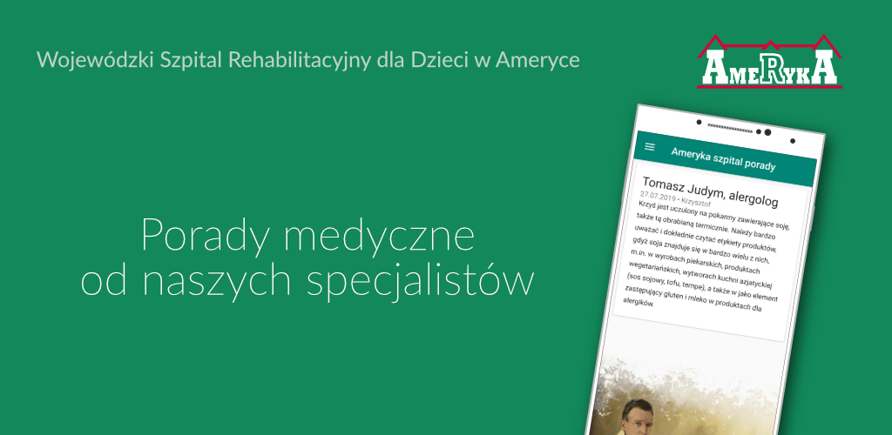
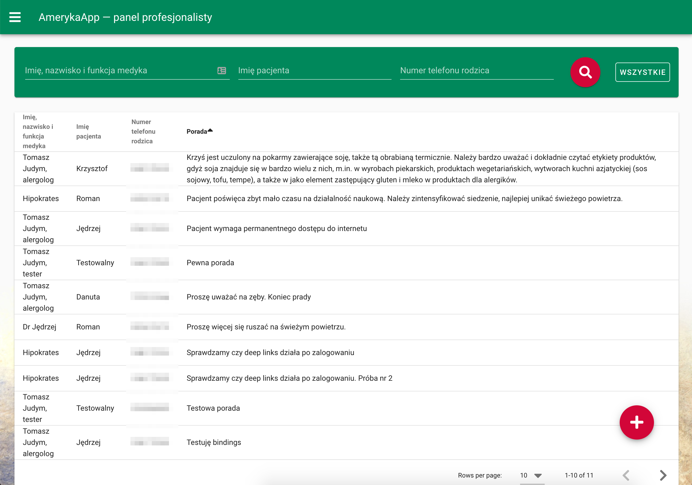
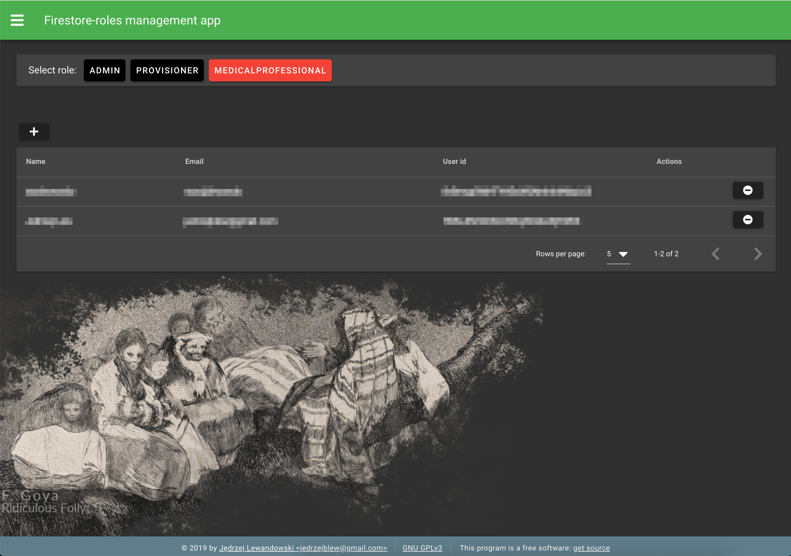
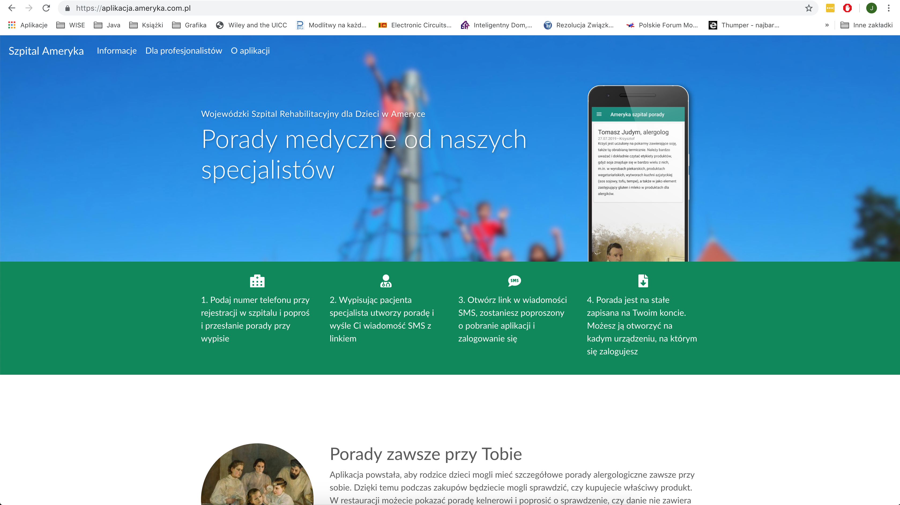

# Personalized advice system for patients of Voievodship Rehabilitation Hospital for Children in Ameryka, Poland

This is a technical description of the project. If you would like to learn how to use it, please go to the [website](https://aplikacja.ameryka.com.pl) instead.

- Website and instructions: [aplikacja.ameryka.com.pl](https://aplikacja.ameryka.com.pl)
- Found a bug or have an idea on an enhancement? Go to the '[Would like to help? section](#would-like-to-help)'
- Need help? Feel free to email me at <jedrzej@lewandowski.doctor>

## About

This system allows to securely send medical advices to patient's mobile phones by sending a deep links to the apps in SMS messages. It consists of an Android app (iOS support may be introduced after android beta tests), an app for medical professionals to send the advices and an app for role management. It is designed in a fully serverless approach using the Google's Firebase BAAS. 

## History

Ameryka is a small village in the Lake District of Poland. It had been named by a landlord who travelled to North America in XIX century and then returned to build the village. In the middle of deep forrest, surrounded by old pines and a lake, there is [the biggest rehabilitation hospital for children in Poland](https://www.ameryka.com.pl). The hospital had always been a leader in the field of tech innovations. On the turn of centuries, it was one of the first hospital in Poland to have a fully digital patient record. In 2019, the doctors from the Allergology Ward had an idea on how to improve patient experience. I was asked to develop the project. 

## Architecture

- Design model: serverless with Google's Firebase
- Auth flow: Firebase auth + [firebase-roles](https://github.com/Jblew/firestore-roles) system that was developed by me during development of this project
- Database: Firestore
- Hosting of the website and the apps: Production and staging sites on firebase hosting: [aplikacja.ameryka.com.pl](https://aplikacja.ameryka.com.pl/). Website is generated by Jekyll
- Deep link system: Firebase dynamic links
- Role management: a Vue SPA: [firestore-roles-manager-ui](https://github.com/Jblew/firestore-roles-manager-ui) deployed to the firebase hosting
- App for medical professionals: a dedicated Vue SPA: [amerykahospital-personalizedadvice-medicalprofessional-app](https://github.com/Jblew/amerykahospital-personalizedadvice-medicalprofessional-app)
- Mobile app: native Android app: [amerykahospital-personalized-advice-client-android](https://github.com/Jblew/amerykahospital-personalized-advice-client-android) released on Play store
- SMS Sending: Firebase functions [amerykahospital-personalizedadvice-serverless](https://github.com/Jblew/amerykahospital-personalizedadvice-serverless) that communicate with SMSAPI
- Deployment and continous integration: Travis CI + NPM

## Subprojects

- [amerykahospital-personalizedadvice](https://github.com/Jblew/amerykahospital-personalizedadvice) — main repository that encompasses the others as a git submodules. It defines the development workspace. Also, the libraries that were developed in the course of developing this project were included.
- [amerykahospital-personalizedadvice-core](https://github.com/Jblew/amerykahospital-personalizedadvice-core) — holds configuration of the project and the model and ORM for advices
- [amerykahospital-personalized-advice-client-android](https://github.com/Jblew/amerykahospital-personalized-advice-client-android) — native android client
- [amerykahospital-personalizedadvice-serverless](https://github.com/Jblew/amerykahospital-personalizedadvice-serverless) — firestore rules guarded and pipelined by firestore-roles + cloud functions for adding advice, generating dynamic deep links and sending SMS messages. Protected by firebase-functions-rate-limiter
- [amerykahospital-personalizedadvice-medicalprofessional-app](https://github.com/Jblew/amerykahospital-personalizedadvice-medicalprofessional-app) — An app for the hospital staff. Vue SPA packaged as a library and deployed in website/professional-panel
- [amerykahospital-personalizedadvice-website](https://github.com/Jblew/amerykahospital-personalizedadvice-website) — static website generated by jekyll + deployments of medicalprofessional-app and firestore-roles-manager-ui
- [typescript-chained-error](https://github.com/Jblew/typescript-chained-error) — a library for throwing errors that can have clean, chained stacks (stack includes 'Caused b'y clause)
- [vuex-notifications-module](https://github.com/Jblew/vuex-notifications-module) — type-safe notification module for vuex 3.x.x
- [firebase-functions-rate-limiter](https://github.com/Jblew/firebase-functions-rate-limiter) — rate limiter to prevent overusage of costly or potentially harmful services like SMS gateway. Uses RealtimeDatabase as a backend.
- [firestore-roles](https://github.com/Jblew/firestore-roles) — solution for handling hierarchical role management in firestore. +requesting roles. +exportable configuration +ecosystem +can be included in CI pipeline
- [firestore-roles-manager-ui](https://github.com/Jblew/firestore-roles-manager-ui) — Vue SPA for managing roles configured and generated by firestore-roles. Single-click accepting or declining of requested roles. Packaged as a library, can be deployed with own configuration with any bundler (like webpack).
- [firestore-roles-vuex-module](https://github.com/Jblew/firestore-roles-vuex-module) — Type-guarded vuex module for easy integration of firestore-roles system into Vue app. Has predefined actions and is full asynchronous.

All modules are deployed with CI, tested and currently working.

## Apps

### Android app

**[App in Play Store](https://play.google.com/store/apps/details?id=pl.com.ameryka.aplikacja)** (PL)

### Medical professional app

 

### Role management app

### Website

## Legal info

This is a free software. Some of the modules are released under GPL-3.0-or-later license while the others are under MIT license. It is denoted separateli in each repository.

**No responsibility of the author**: both licenses state that the author of the software do not provide any warranty on the software nor its functioning nor any situations caused by the functioning of the software. Author is not liable. Nevertheless, In his freedom, the author puts much effort to make the system useful and ensure its proper functioning.

## Author vs Operator vs ADO (personal data administrator)

- [Jędrzej Lewandowski](https://jedrzej.lewandowski.doctor/) is the author of the system
- Voievodship Rehabilitation Hospital for Children in Ameryka is the operator of the system
- Operator of the system is the entity that processes personal data and the operator has designeted an ADO.

## 

## Informations

### Need help?

- Feel free to email me at <jedrzej@lewandowski.doctor>

### Would like to help?

Warmly welcomed:

- Bug reports via issues
- Enhancement requests via via issues
- Pull requests
- Security reports to jedrzej@lewandowski.doctor

---

Made with ❤️ by [Jędrzej Lewandowski](https://jedrzej.lewandowski.doctor/):

# amerykahospital-personalizedadvice-settings
