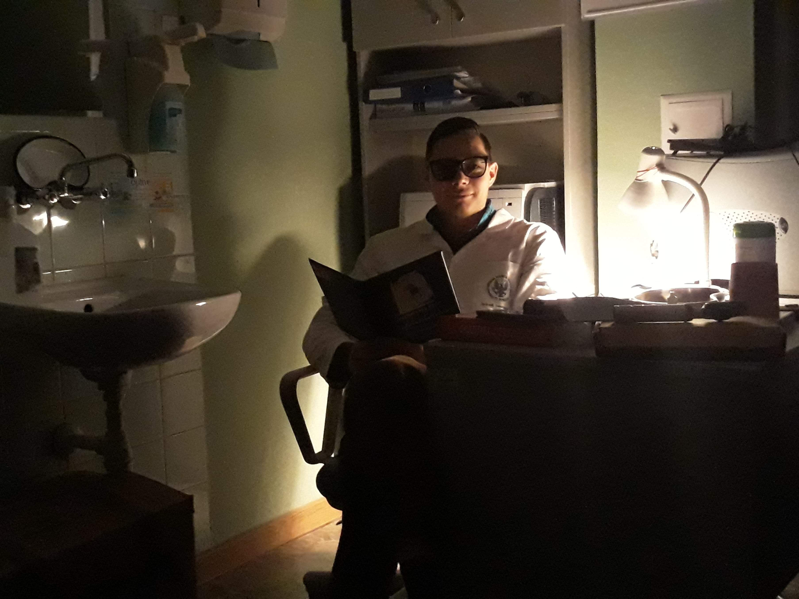

# Personalized advice system for patients of Voievodship Rehabilitation Hospital for Children in Ameryka, Poland

This is a technical description of the project. If you would like to learn how to use it, please go to the [website](https://aplikacja.ameryka.com.pl) instead.

- Website and instructions: [aplikacja.ameryka.com.pl](https://aplikacja.ameryka.com.pl)
- Found a bug or have an idea on an enhancement? Go to the '[Would like to help? section](#would-like-to-help)'
- Need help? Feel free to email me at <jedrzej@lewandowski.doctor>

## About

This system allows to securely send medical advices to patient's mobile phones by sending a deep links to the apps in SMS messages. It consists of an Android app (iOS support may be introduced after android beta tests), an app for medical professionals to send the advices and an app for role management. It is designed in a fully serverless approach using the Google's Firebase BAAS. 

## History

Ameryka is a small village in the Lake District of Poland. It had been named by a landlord who travelled to North America in XIX century and then returned to build the village. In the middle of deep forrest, surrounded by old pines and a lake, there is [the biggest rehabilitation hospital for children in Poland](https://www.ameryka.com.pl). The hospital had always been a leader in the field of tech innovations. On the turn of centuries, it was one of the first hospital in Poland to have a fully digital patient record. In 2019, the doctors from the Allergology Ward had an idea on how to improve patient experience. I was asked to develop the project. 

## Architecture

- Design model: serverless with Google's Firebase
- Auth flow: Firebase auth + [firebase-roles](https://github.com/Jblew/firestore-roles) system that was developed by me during development of this project
- Database: Firestore
- Hosting of the website and the apps: Production and staging sites on firebase hosting: [aplikacja.ameryka.com.pl](https://aplikacja.ameryka.com.pl/). Website is generated by Jekyll
- Deep link system: Firebase dynamic links
- Role management: a Vue SPA: [firestore-roles-manager-ui](https://github.com/Jblew/firestore-roles-manager-ui) deployed to the firebase hosting
- App for medical professionals: a dedicated Vue SPA: [amerykahospital-personalizedadvice-medicalprofessional-app](https://github.com/Jblew/amerykahospital-personalizedadvice-medicalprofessional-app)
- Mobile app: native Android app: [amerykahospital-personalized-advice-client-android](https://github.com/Jblew/amerykahospital-personalized-advice-client-android) released on Play store
- SMS Sending: Firebase functions [amerykahospital-personalizedadvice-serverless](https://github.com/Jblew/amerykahospital-personalizedadvice-serverless) that communicate with SMSAPI

## Apps

### Android app

### Medical professional app

 

### Role management app

### Website

## Informations

### Need help?

- Feel free to email me at <jedrzej@lewandowski.doctor>

### Would like to help?

Warmly welcomed:

- Bug reports via issues
- Enhancement requests via via issues
- Pull requests
- Security reports to jedrzej@lewandowski.doctor

---

Made with ❤️ by [Jędrzej Lewandowski](https://jedrzej.lewandowski.doctor/):

