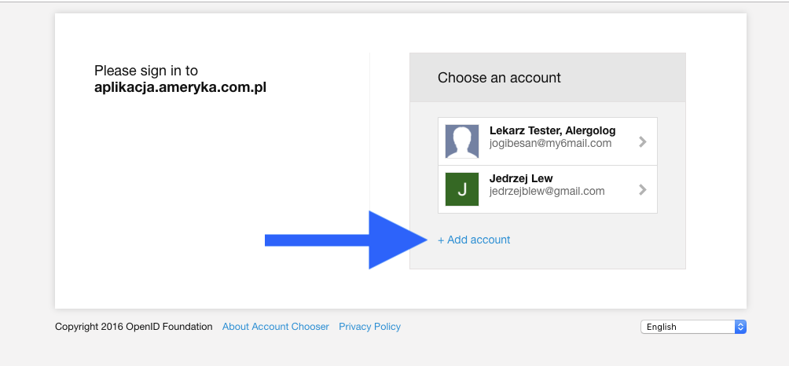
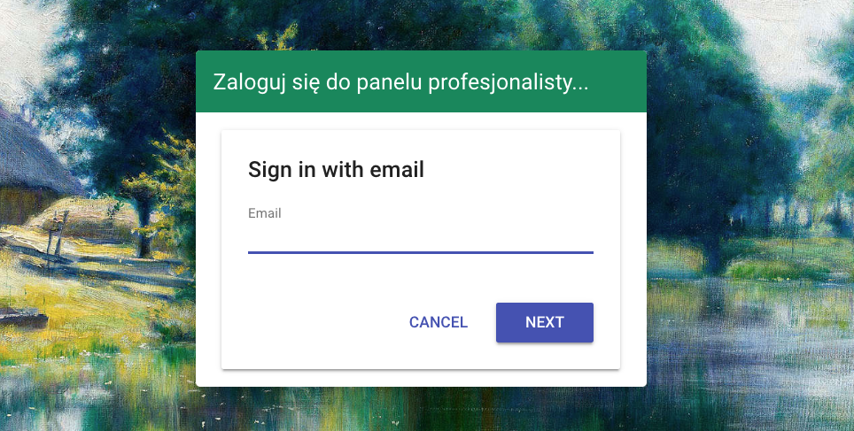
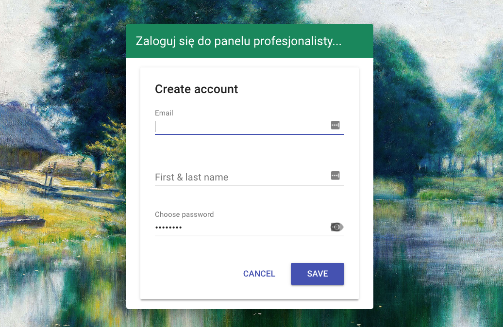
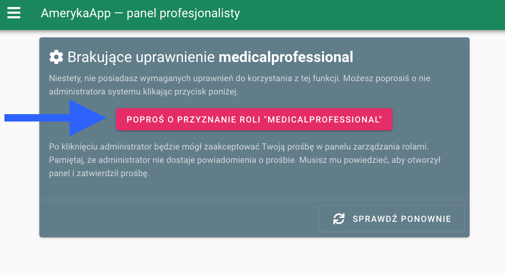
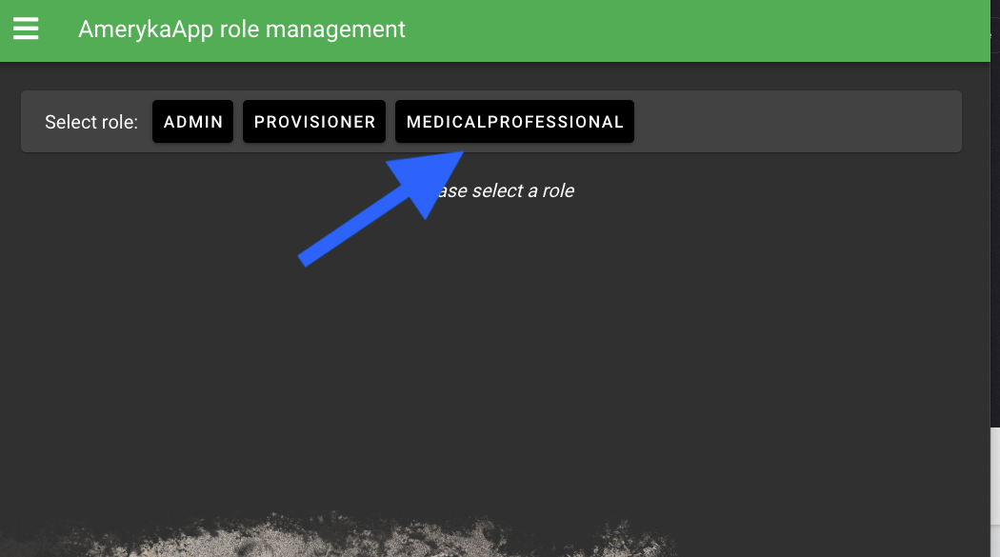
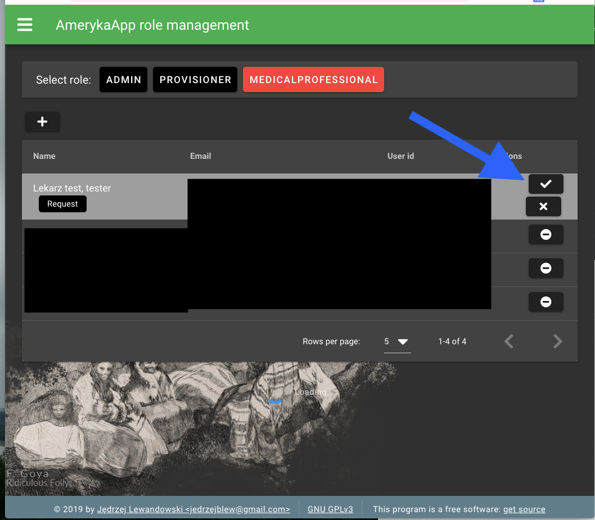

# Instrukcja zakładania kont — aplikacja.ameryka.com.pl

### 1. Utwórz nowe konto email

### 2. Wejdź do Panelu Profesjonalisty (https://aplikacja.ameryka.com.pl/professional-panel/#/) i kliknij przycisk "Sign In with Email"

### 3. Kliknij "+ Add account"

### 4. Wprowadź adres email

### 5. Wprowadź nazwę użytkownika w formacie "[(tytuł)] [Imię] [Nazwisko], [specjalizacja]"

### 6. Kliknij "Poproś o przyznanie roli medicalprofessional"

### 7. Otwórz Panel uprawnień (https://aplikacja.ameryka.com.pl/role-management/) 

### 8. Zaloguj się na konto administratora

### 9. Wybierz rolę "medicalprofessional"

### 10. Zatwierdź "request"

... Gotowe